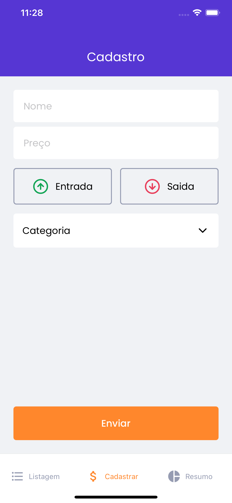
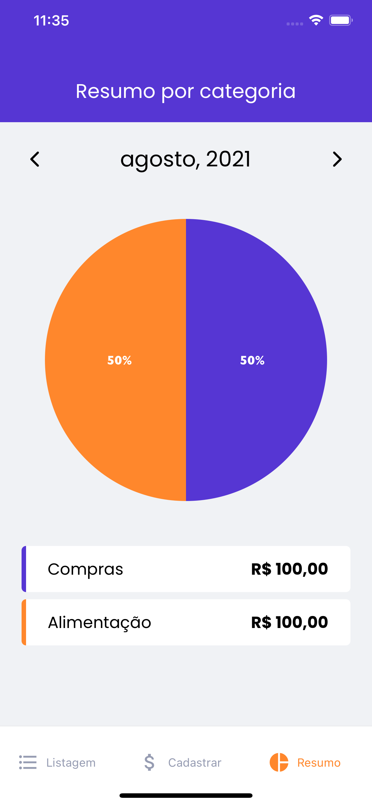

<h1>Resultado Final</h1>

<h1 align="center">
  Finance
  <br /> <br />
  
  <br /> <br />
  
    <br /> <br />
   
     <br /> <br />
   
     <br /> <br />
   
     <br /> <br />
      
</h1>

# `Indice`

<a href="#projeto">1. Sobre o Projeto</a> <br />
<a href="#Tecnologias-utilizadas">2. Tecnologias utilizadas</a> <br />
<a href="#Como-baixar-o-projeto">3. Como baixar o projeto</a>

## Sobre o Projeto

App para controle de finanças pessoais.
---

## Tecnologias utilizadas

O projeto foi desenvolvido utilizando as seguintes tecnologias:

- React-Native
- TypeScript
- Styled-Components
- ReactIcons
- React Navigation
- react-navigation/native
- react-native-vector-icons
---
## Como baixar o projeto


```bash

  # Clonar o repositório
  $ git clone https://github.com/danalmeidadev/financeMobile

  # Entrar no diretório
  $ cd financeMobile

  # Instalar as dependências
  $ yarn

  # Iniciar o projeto
  $ yarn start

  #Mac OS
  $ yarn pod

  # De acordo com sistema operacional
  $ yarn android
  # ou
  $ yarn ios
```

<br /><br />
Desenvolvido por **Dan Almeida(devdanalmeida)**